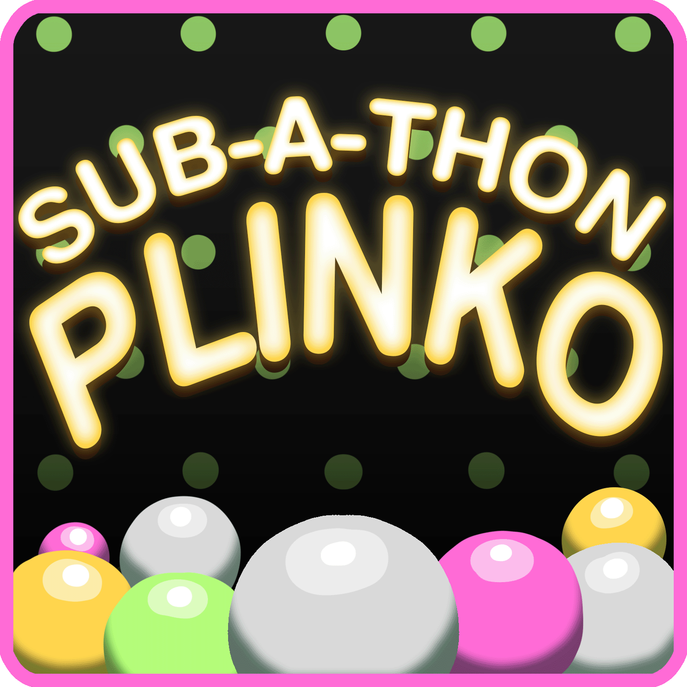
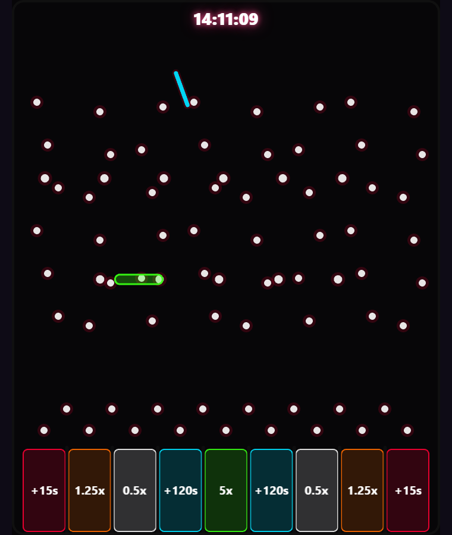
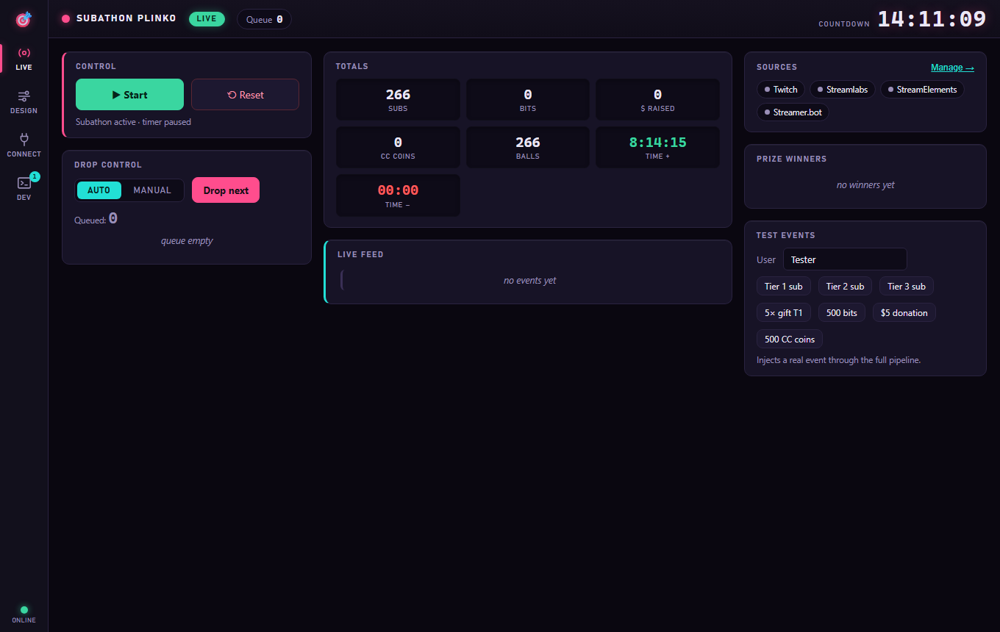
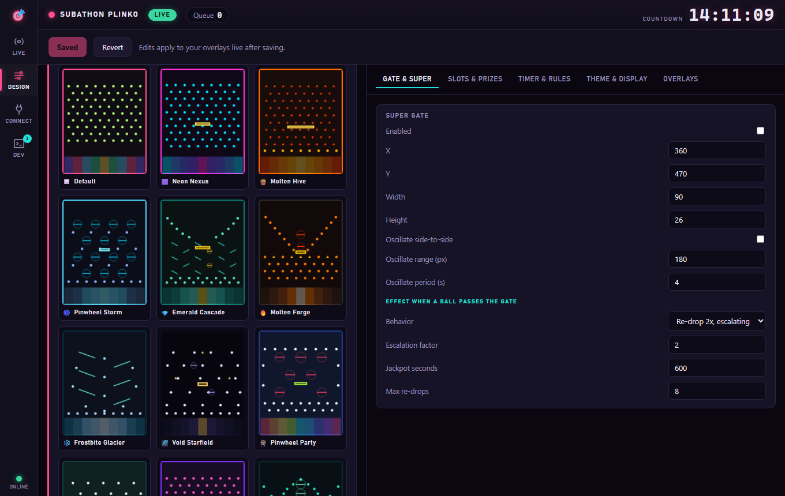
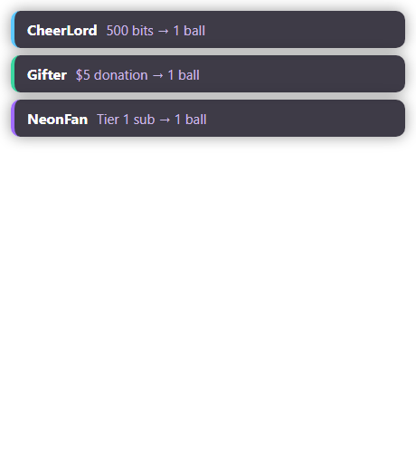
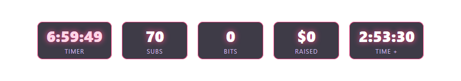

<p align="center"></p>

# Subathon Plinko

**Turn your Twitch sub-a-thon into a live Plinko game.** Every sub, cheer, and donation drops
a ball onto a neon board — where it lands adds or removes time, multiplies the clock, or wins a
prize. A polished set of OBS overlays **and** a control panel, in a single download. Runs entirely
on your PC — no monthly service, no account with us.



---

## ✨ What it is

Install the app, log in with Twitch, drop a few browser sources into OBS, and you're live. From
then on:

- A **viewer subs / cheers / donates** → the app turns it into one or more balls.
- Balls **drop onto the board** and bounce through the pegs into one of 9 slots.
- **Where a ball lands is exactly what happens** — the slot it physically falls into is what pays
  out. What your viewers see *is* the result (no rigging, no mismatch).
- The slot's outcome **changes your subathon timer** (add/remove/multiply time) or awards a prize.

Everything is configurable and stylable — the board, the rules, the timer, and all four overlays.

## 📸 Screenshots

**Control panel** — start/stop, watch the timer & queue, totals, live feed, and test injector:



**Board designer** — drag pegs, tune them live, and pick from 20+ premade board designs (or save your own):



**Overlays** — a styleable events feed and goals bar (plus the board and a big subathon timer):

<p>
  
  
</p>

---

## ⬇️ Download & install

1. Grab the latest **`Subathon Plinko Setup x.y.z.exe`** from the [**Releases**](https://github.com/eviletho/Sub-a-thon-Plinko/releases) page.
2. Run it — Windows, installs per-user (no admin), makes a desktop shortcut.
3. Launch it. **That's it** — no Node, no building, nothing else to install.

The app updates itself: new versions download quietly in the background and install the next time
you close it — **never mid-subathon.**

## 🚀 Quick start

1. Open **Subathon Plinko**.
2. **Connect** tab → **Twitch → Log in**, and enter the code it shows at the Twitch link.
3. *(Optional)* add your **Streamlabs**/**StreamElements** token, and/or **Streamer.bot** for Crowd Control.
4. **Connect** tab → **OBS Browser Sources** → copy each URL into OBS as a **Browser Source**.
5. **Live** tab → **Start**. Now every sub / cheer / donation drops a ball. 🎉

## 🎮 How it works

- The app runs a tiny **local server on your PC** (`127.0.0.1:3737`) that serves the transparent
  overlay pages and the control panel — nothing is exposed to the internet.
- It connects **outbound** to Twitch / Streamlabs / StreamElements / your Streamer.bot to receive
  events, converts them into balls, and drops them.
- The **board overlay runs the real physics**; when a ball lands it reports the slot, and the app
  credits exactly that slot — so the visual and the payout always match.
- State is saved continuously and **survives restarts and crashes**, so multi-day subathons keep
  their timer and totals.

## 🧩 Features

- **Earn balls from anything** — $ per ball, bits per ball, sub tiers 1/2/3, gift subs, and Crowd
  Control coins — all rates configurable. Optional **per-viewer banking** so leftover bits/$ carry
  to a viewer's next event (700 bits @ 500 = 1 ball + 200 saved), or turn it off.
- **9 configurable slots** — each one adds time, removes time, multiplies the clock, or awards a prize.
- **Timer modes** — countdown (with optional cap), **reverse** (balls *remove* time so viewers race
  to *end* the stream), or **mixed**.
- **Super gate** — a placeable/oscillating gate that triggers re-drop-and-double (escalating),
  re-drop-once, or an instant jackpot.
- **Visual board designer** — drag / add (click-drag to size & spin) / right-click to remove pegs
  in four shapes (circle, flat, spinner, triangle), **oscillating "moving-wall" pegs**, **mirror
  mode**, grid snap, and a **live animated preview** so you see spins and slides as you build.
- **20+ premade board designs** (Neon Nexus, Molten Hive, Pinwheel Storm, DNA Twist, Tesla Coil,
  Spiral Vortex, Smiley… ) — one click to load, and **save your own** designs to the same gallery.
- **Full theming** — 12 one-click theme presets plus per-color control for the board **and** the
  timer / feed / goals overlays (fonts, panels, accent colors, which stats show).
- **Four transparent OBS overlays** — Plinko board, subathon timer, recent-events feed, goals/totals bar.
- **Prizes** — a prize list with win chances and a winner log.
- **Polish** — concurrent falling balls with viewer names, optional Twitch-avatar balls, sounds,
  and an always-alive board.

## 🔌 Integrations

| Source | What it counts |
| --- | --- |
| **Twitch** | subs, resubs, gift subs, bits (cheers) |
| **Streamlabs** | donations |
| **StreamElements** | tips |
| **Crowd Control** (via Streamer.bot) | coin spends, excluding bit-bought coins |

- **Twitch** works out of the box — just log in (uses a built-in Twitch app; no setup). Advanced
  users can plug in **their own** Twitch app under **Connect → Twitch → Advanced** (no client
  secret is ever needed — it uses the OAuth Device Code Flow).
- **Crowd Control:** in Streamer.bot, add an action on the CC coin-exchange trigger that does a
  **WebSocket Broadcast (Custom)** with
  `{ "plinko":"ccCoins", "user":"Name", "userId":"123", "coins":500, "source":"PayPal" }`.
  The app excludes configured sources (default `Twitch-Bits`) so bit-bought coins don't double-count.

## 🎥 OBS setup

With the app running, the **Connect** tab lists copyable URLs. Add each as a **Browser Source**
(they're transparent):

| Overlay | URL | Suggested size |
| --- | --- | --- |
| Plinko board | `http://127.0.0.1:3737/board` | 1080 × 1350 |
| Subathon timer | `http://127.0.0.1:3737/timer` | 600 × 200 |
| Recent events feed | `http://127.0.0.1:3737/feed` | 460 × 520 |
| Goals bar | `http://127.0.0.1:3737/goals` | 900 × 160 |

- For board **sound effects** to reach the stream, enable **Control audio via OBS** on the board source.
- **Don't** toggle the board source's visibility mid-stream — hiding it reloads the page.
- The control panel can be docked in OBS via **Docks → Custom Browser Docks** using
  `http://127.0.0.1:3737/panel`.
- Default port is `3737`; if it's taken the app scans upward and the panel shows the actual URLs.

## 🔒 Privacy

Everything runs on your machine. The app talks only to **Twitch / Streamlabs / StreamElements /
your Streamer.bot** (for events) and **GitHub** (to check for updates). There's **no account with
us and no telemetry.** Your platform tokens are encrypted locally with the OS keystore (Windows DPAPI)
and are never included in settings exports.

---

## 🛠 For developers

<details>
<summary>Build from source</summary>

Requires **Node.js 20+** (developed on Node 24) on **Windows** (the target platform).

```sh
npm install
npm run dev        # control panel with hot reload (run `npm run build` once first for overlays)
npm run build      # build main / preload / renderer into out/
npm run start      # launch the packaged-style app (server + panel) to test overlays/OBS
npm run typecheck
npm run test
npm run package    # build + Windows NSIS installer in dist/
```

The built-in Twitch **public** client id is injected at build time:
`TWITCH_CLIENT_ID=<id> npm run package` (see `.env.example`). It uses the OAuth Device Code Flow,
so **no client secret** is used or needed. Maintainers: see the (local) release runbook for
publishing to GitHub Releases.

**Architecture:** the **main process** is the single source of truth (server, integrations, game
state, persistence). **Overlays** are thin transparent pages that render broadcast state over
Socket.IO. The **control panel** is an Electron window (also dockable) that sends commands and edits
config. Shared schema / types / award & timer math / physics live in `src/shared` and are reused by
all three.

</details>

## License & credits

Made by **Evilee**. Released under the [MIT License](LICENSE).
